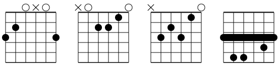

# canvasguitarchords
Vanilla Javascript function to draw guitar chords on canvas

very early version, suited for 150x150 pixel canvas
raw manipulation of the `canvas.context` to enable direct manipulation

Usage
-----
give a array of 6 strings to the drawChords function. Starting with low E string, give the fretted fret.
indicate a mutted fret with a negative value.

### basic 
with a `<div id="gmajor"></div>` in your html, just add this two lines of code
```
 var gmajor = new GChord('gmajor');
 gmajor.draw([3,2,0,0,0,3]);
```

If you'd rather let the function figure out for itself how to draw the chord:

```
 var gminor = new GChord('gminor');
 gminor.draw("Gm");
```

### advanced
Add fingering notation by passing in an object containing both frets and the fingers to use:
```
 var cmajor = new GChord('cmajor');
 cmajor.draw({frets: 		[-1,3,2,0,1,0],
        	  fingers: 		[0,3,2,0,1,0]});
```

Have your chord dynamically fill the parent container by passing in fillContainer: true as an option.  When the parent container is resized, the chord will be
redrawn accordingly.
```
 var g = new GChord('resizeable', 'A', {fillContainer: true});
 g.drawChord(g.getChord({root: "A", fingering: "BARRE"});
```

### Barre chords

When you use fingering notation, barres will be automatically added as appropriate and - if necessary - the fret to start on will be drawn:

```
  var abarre = new GChord('abarre');
  abarre.draw({frets:		[5,7,7,6,5,5],
        	   fingers:		[1,3,4,2,1,1]});
```


###  using the dictionnary 
```
var cseven = new GChord('cseven','C7');
cseven.draw(gChords.open.C7)
```
### Super advanced: getting chords algorithmically
If you want to generate chords with certain things specified (eg. "I want a barre chord rooted on the A string"),
you'll need to use this

```
var chord = new GChord('loc','E');
var c = chord.getChord({
	root: "E",
	fingering: "barre",
	rootString: "A",
	type: "major"
});
chord.draw(c);
```
"fingering", "rootstring" and "type" are optional.  Fingering will try for an open fingering and if none is found, attempt to generate
a barre chord.  Rootstring will try for a barre chord on the E string; if that fails will root it on A. Type will default to major; supported types are:
 - major
 - minor
 - 7
 - m7
 - maj7 
 - sus4
 - sus2
 - 7sus4

### css
generated html is very simple and allow easy css manipulation 
```
<div id="gmajor" class="chorddiv"><h3></h3><canvas width="140" height="140"></canvas></div>
```

### going further
Basic support for larger/smaller canvas by changing options
see example/index.html for complete code




Roadmap
-------
* propose a high level module (with chord and text)
* propose mini-barchord, for powerchord for example.


* enable full auto-sizing based on canvas width  - done
* enhance predefined common chords in dictionary - done.  Barre chords are calculated algorithmically.
* support for upper position on the neck (e.g. A barchord start on 5 fret) - done
* propose a class definition - done
* support bar chord in quick chord methods (drawChord) - done
* be able to adapt to other canvas size - done 

Versions 
--------
0.1 - simple low level function, basic dictionary, options, barchords
0.2 - class oriented code
